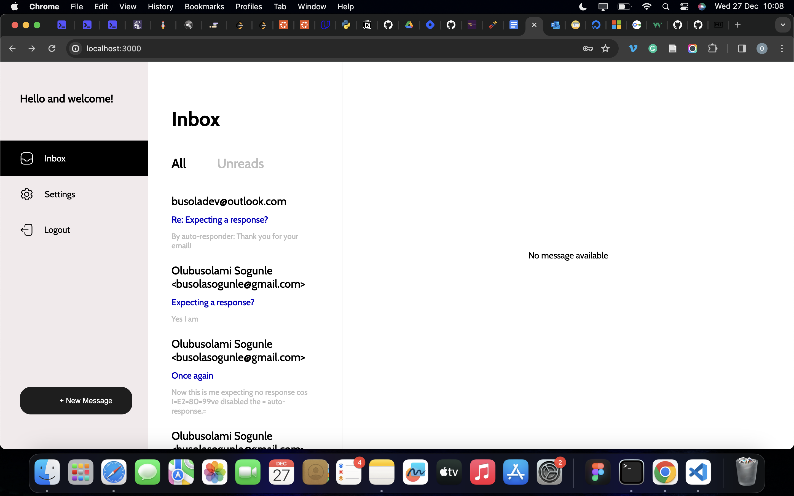

# Intelligent Email Auto-Response System

This repository contains code written in Python and Javascript to build an intelligent email auto-response system. The backend was built using Python (Flask) with PostgreSQL, while the frontend was built with React. The model to be utilised is a fine-tuned version of the GPT2 LLM. There's still a lot of work to be done, but I thoroughly enjoyed this project, and I'm open to collaborations!

## Getting Started: Pre-requisites and Local Development

Developers running this project should already have python3, pip, postgresql, redis and node installed on their local machines. All code in the backend follow the PEP 8 style guide. It is also recommended to run the project in a virtual environment. Instructions for setting up a virual environment for your platform can be found in the python docs.

## Database Setup
Ensure postgresql is running then run the folliowing commands on your terminal
``` 
psql autoresponse
```
``` 
psql autoresponse< autoresponse.psql
```
You can now check out the database tables using the following commands
``` 
psql autoresponse
\dt
```

## Backend Setup
The following steps are needed to set-up the backend:
1. Navigate to the backend folder
2. Set up your virtual environment and activate it
3. Run `pip install requirements.txt` on your terminal (still inside the backend folder and virtual environment)
4. Run 
```
export FLASKAPP=flaskr
export FLASKENV=development
flask run 
```
The project should be running on http://127.0.0.1:5000 on your computer . If you are running windows locally, you can look for the equivalent of the commands for windows in the Flask documentation.

### Celery Setup
Celery is a library which handles the asynchronous execution of the email polling  and autoresponse features. You can start it up by running the following commands. Note: You need to navigate to the backend folder on 2 different terminals, and activate the virtual environment on both terminals.

On terminal 1, run:
```
celery -A app.celery worker --loglevel=info
```

On terminal 2, run:
```
celery -A app.celery beat --loglevel=info
```

If you did not see any errors, celery worker and beat should be working fine.

## Frontend Setup
1. Navigate to the frontend folder
2. Run the following commands
```
npm install //run this only once to install the dependencies
npm start  //to run the project at any time
```

Your project should be up and running and looking like 

Feel free to tweak, experiment and reach out for a collab!!

